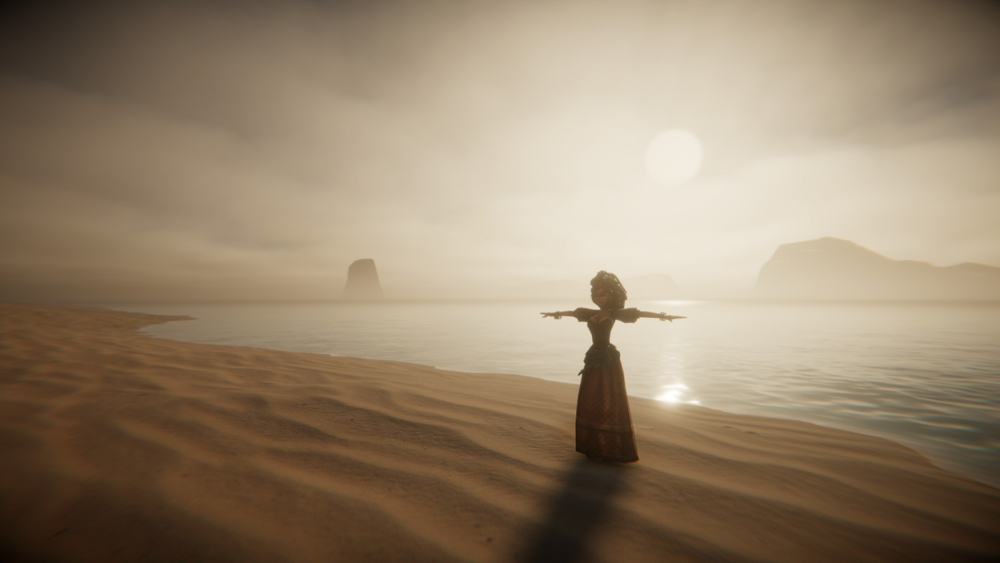

# AkademiJam

## Takım İsmi
U97 Unity Takımı

## Takım Üyeleri
- ***Melis Naz Tanrıverdi*** - Product Owner
- ***Meliha Ece Delier*** - Developer
- ***Melike Çetin*** - Developer
- ***Mert Batuhan Şahin*** - Developer
- ***Mustafa yıldız*** - Scrum Master

## Oyun İsmi
 The Unforeseen 

## Oyun Açıklaması
The Unforeseen ,oyuncumuz bir medyumu canlandırmaktadır .medyumun görevi çeşitli yapbozları çözerek gelen  müşterisinnin  ölmüş bir yakınıyla konuşmasını sağlar. yapbozlar çözülürken müşterimizin hikayesini ve medyumuuzun gelişimini görmekteyiz

## Oyun Özellikleri
- 3D
- Zorlu ve birbirinden dinamik  bulmacalar
- Zengin hikaye

## Hedef Kitle 
- Hikaye odaklı oyun severler
- Gizem ve bulmaca severler
- Bağımsız oyun hayranları
- 10+
- PC oyuncuları

## Product backlog 
- https://docs.google.com/spreadsheets/d/11Jortk7Zlt1x35nrrcsGkpNUBSMPmxbxRoXy3PgYQWg/edit?gid=0#gid=0
---
# **SPRINT 1**
 sprinti tamamlanması için beklenen değer 18 dir
 
 **Puan tamamlama mantığı**: Proje boyunca tamamlanması gereken backlog puanı 100 dur. İlk Sprint için bitirilmesi istenilen puan sayısı 18 olarak belirlenmiştir.Birinci sprinte  sadece 14 puan görev tamamlanabilmiştir .4 puan değerinde görev 2.sprinte bırakılmıştır .

**Daily scrum**: ağırlıklı discord olmak üzere  Whatsapp ve  Discord üzerinden iletişime geçildi . yoğunluk ve farklı zamanlarda müsait olma durumu yüzünden haftada 2-3 toplantı yapıldı.

**Bazı iletişim mesajları ve toplantı görüntüleri**: https://imgur.com/a/R0IuNAT

## Screenshot:

**Burndown chart**
 

**Sprint Board Screenshot:**

**kanban template URL**
https://trello.com/invite/b/P5xBTnDD/ATTI5117330b54c6543597cf4d6aa20f84c3823A666F/kanban-template

**Ürün ile ilgili bazı screenshotlar:**

## Sprint Review:
- oyun tasarımına  3d oco tarzına benzer bir tasaım  kulanılcak.
- oyunundaki karekter tasarımı  için farklı tasarımlar dennencek.
- seneryo sonu üzerine karar verilmesi  gerekiyor.
- oyunda elleri  azaltıcaz

## Sprint Retrospective
-  Roller ile ilgili düzenleme yapılmış,melike tasarım ekibine geçmiştir
-   oyunun iconu kararlaştıralacak
  
# **SPRINT 2**

 sprinti tamamlanması için beklenen  değer   40 'dır
 
**Puan tamamlama mantığı** : Proje boyunca tamamlanması gereken backlog puanı 100 dur.İkinci Sprint için bitirilmesi istenilen puan sayısı 40 olarak belirlenmiştir. bu sprinte  tamamlanan ve test aşamasında olan görevlerin puanı 32 dir 

**Daily scrum** : ağırlıklı discord olmak üzere  Whatsapp ve  Discord üzerinden iletişime geçildi . yoğunluk ve farklı zamanlarda müsait olma durumu yüzünden haftada 2-3 toplantı yapıldı.

**Bazı iletişim mesajları ve toplantı görüntüleri** : https://imgur.com/a/ekxHnvj

## Screenshot:

**Burndown chart**
 

**Sprint Board Screenshot:**

**kanban template URL**
https://trello.com/invite/b/66856cab7d0ffb9edf5661db/ATTI5117330b54c6543597cf4d6aa20f84c3823A666F/kanban-template

**Ürün ile ilgili bazı screenshotlar:**

**örnek videolar:**

https://github.com/user-attachments/assets/5860a644-4909-4aba-9cdc-72f10f2e1b68

https://github.com/user-attachments/assets/f540524f-1f20-4b9f-9b71-8014bc00f42e

## Sprint Review:
- bulmaca sayısı azaltıldı
## Sprint Retrospective
- oyun ikonu tartışılacak
- görev dağılımları yeniden değerledirilecek
  
# **SPRINT 3**
sprinti tamamlanması için beklenen değer 42 dir

**Puan tamamlama mantığı**: Proje boyunca tamamlanması gereken backlog puanı 90 düşürülmüştür. Son Sprint için bitirilmesi istenilen puan sayısı 42 olarak belirlenmiştir ve toplamda 90 puanlık  toplam puanın 88 puanına ulaşılmıştır

**Daily scrum**: ağırlıklı discord olmak üzere  Whatsapp ve  Discord üzerinden iletişime geçildi .  diğer  sprinten farklı  olarak genel  toplantı dışında  görevlerin işleyişleri ile alakalı olarak toplantılar yapıldı.

**Bazı iletişim mesajları ve toplantı görüntüleri**: https://imgur.com/a/fizObND

## Screenshot:

**Burndown chart**

  
